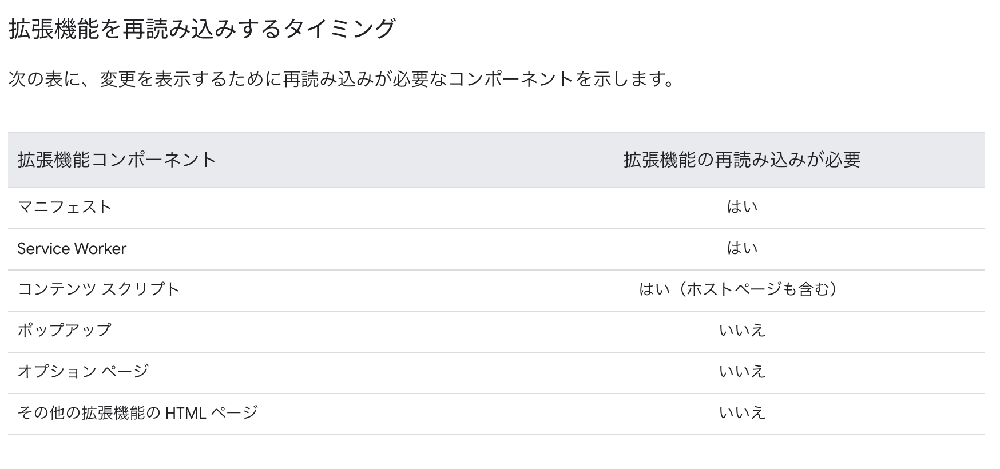

# hello-world

下記記事のチュートリアルを参考に作成したものです。

https://developer.chrome.com/docs/extensions/get-started/tutorial/hello-world?hl=ja

https://github.com/GoogleChrome/chrome-extensions-samples/tree/main/functional-samples/tutorial.hello-world

デベロッパー モードで解凍された拡張機能を読み込むには:

新しいタブで chrome://extensions と入力して、[拡張機能] ページに移動します。（設計上、chrome:// URL はリンクできません）。
または、拡張機能メニューのパズルボタンをクリックし、メニューの下部にある [拡張機能を管理] を選択します。
または、Chrome メニューをクリックし、[その他のツール] にカーソルを合わせて [拡張機能] を選択します。
[デベロッパー モード] の横にある切り替えスイッチをクリックして、デベロッパー モードを有効にします。
[展開済みを読み込む] ボタンをクリックして、拡張機能のディレクトリを選択します。

